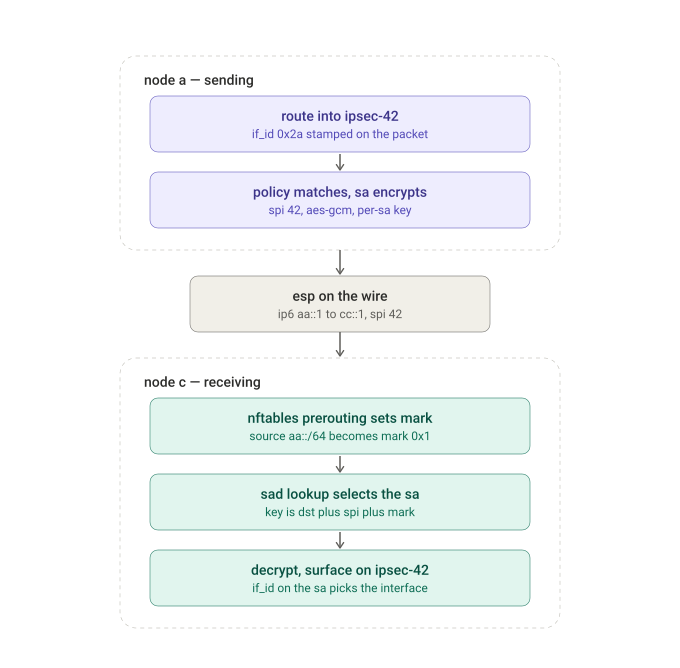
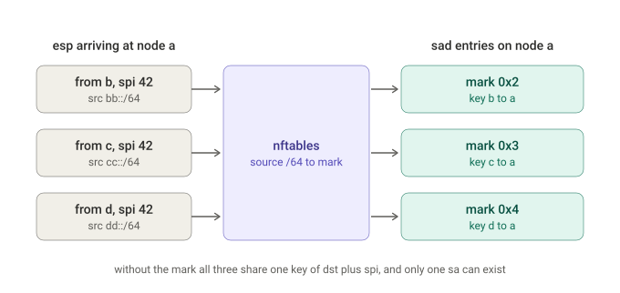
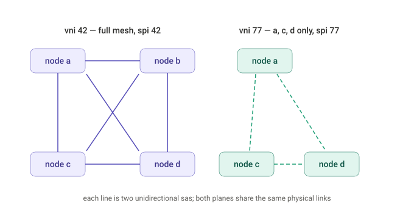

# Per-VNI IPsec mesh on Linux XFRM

A working reference for multi-tenant IPsec where **the SPI is exactly the tenant
id (VNI)** — the case where a receiver cannot choose its own SPIs. Runs entirely
in network namespaces on one machine. Nothing outside the namespaces is touched.

```
sudo ./09-vni-pair.sh     # two nodes, two VNIs — start here
sudo ./10-vni-mesh.sh     # four nodes, VNI 42 full mesh + VNI 77 partial
sudo ./99-cleanup.sh
./show.sh                 # inspect at any time
```

Both scenarios are standalone and tear down whatever came before. They pause
between sections; set `NOPAUSE=1` to run straight through. Everything
configurable lives in `00-common.sh`.

## Requirements

- Linux kernel 4.19+ (XFRM interfaces landed in 4.19); 5.x+ recommended
- `iproute2` 4.19+
- `nftables` (falls back to `ip6tables`)
- root
- `tcpdump` and `openssl` optional — scripts degrade gracefully without them

```
ip link add test0 type xfrm dev lo if_id 1 && ip link del test0 && echo OK
```

## Files

| File | What it is |
|---|---|
| `00-common.sh` | Addressing, identity, per-SA key derivation, helpers. Sourced, not run. |
| `09-vni-pair.sh` | Two nodes, two VNIs. Every command printed. 4 states per node. |
| `10-vni-mesh.sh` | Four nodes. VNI 42 across A/B/C/D, VNI 77 across A/C/D. |
| `99-cleanup.sh` | Removes all namespaces and stranded veths. |
| `show.sh` | Dumps links, addresses, routes, states, policies, mark rules, counters. |
| `diagrams/` | The three SVGs below. |

---

## The design

```
    Node A  <--- one link, two encrypted tenants --->  Node C

    VNI 42   spi 42   if_id 0x2a   ipsec-42   fd2a:a::1 <-> fd2a:c::1
    VNI 77   spi 77   if_id 0x4d   ipsec-77   fd4d:a::1 <-> fd4d:c::1
```

Each node owns a unique underlay `/64` and a `/64` slice of each VNI's overlay:

| node | underlay | mark | vni 42 overlay | vni 77 overlay |
|---|---|---|---|---|
| a | `2001:db8:aa::/64` | `0x1` | `fd2a:a::/64` | `fd4d:a::/64` |
| b | `2001:db8:bb::/64` | `0x2` | `fd2a:b::/64` | — |
| c | `2001:db8:cc::/64` | `0x3` | `fd2a:c::/64` | `fd4d:c::/64` |
| d | `2001:db8:dd::/64` | `0x4` | `fd2a:d::/64` | `fd4d:d::/64` |

### How a packet crosses



Four mechanisms are doing distinct jobs, and it's worth keeping them separate in
your head:

- **`if_id`** — routing into `ipsec-42` stamps the packet. Only policies with
  the same `if_id` will match it. This is what keeps tenants apart on the send
  side, and what puts a decrypted packet on the right interface on the receive
  side.
- **The policy** decides *whether* to encrypt and *which peer* to send to. The
  selector is the inner destination prefix; the template supplies the outer
  address.
- **The SA** does the crypto. `SPI = VNI` goes on the wire.
- **The mark** exists only on the receive side, and only to say *who sent this*.

### Why the mark exists



Linux looks up an inbound SA in the `state_byspi` hash, keyed on destination
address, SPI and protocol. With `SPI = VNI`, every peer sending to a node uses
the *same* destination and the *same* SPI — so all their inbound states collide,
and `xfrm_state_add` rejects the second one with `EEXIST`.

The real uniqueness key includes the mark: `(dst, spi, proto, mark)`. So set a
mark from the outer source prefix before XFRM sees the packet. nftables
PREROUTING runs well before the ESP handler reaches `xfrm_input`:

```
table inet vnimesh {
  chain prerouting {
    type filter hook prerouting priority mangle;
    meta l4proto esp ip6 saddr 2001:db8:cc::/64 meta mark set 0x3
  }
}
```

Then per-sender states coexist:

```
ip xfrm state add src <peer> dst <self> proto esp spi 42 reqid 42 \
    mode tunnel if_id 0x2a \
    mark 0x3 mask 0xff output-mark 0x0 mask 0xff \
    replay-window 64 \
    aead 'rfc4106(gcm(aes))' <derived-key+salt> 128 \
    sel src <peer-overlay>/64 dst <self-overlay>/64
```

Four things that matter:

- **The mark identifies the sender, not the tenant.** The SPI already separates
  tenants. So mark rules are `N-1` per node regardless of how many VNIs exist.
- **`mark VALUE mask MASK`**, not `VALUE/MASK`. iproute2 *prints* the slashed
  form but parses the spaced one. This one wastes an afternoon.
- **Outbound needs no mark.** Different peers mean different destination
  addresses, so `state_bydst` already separates them.
- **Marks go on states, never on policies.** A policy with no mark clause has
  `mark.m = 0`, so `(skb->mark & 0) != 0` is always false and it matches any
  mark — which is what you want.

**`output-mark 0x0 mask 0xff`** clears the sender id after decryption so it
can't leak into downstream `ip rule` or netfilter decisions.

With only two nodes there is no collision at all — each node has one inbound
state per VNI and the SPIs already differ between VNIs. The mark is a **no-op**
in `09-vni-pair.sh`. It's there so the configuration is shape-identical to the
N-node case, and to show it costs nothing.

### The mesh



`10-vni-mesh.sh` builds both planes: 9 edges, 18 unidirectional SAs. Per-node
object counts fall out of membership rather than being special-cased:

| node | states | policies | interfaces | mark rules |
|---|---|---|---|---|
| a | 10 | 10 | 2 | 3 |
| b | 6 | 6 | 1 | 3 |
| c | 10 | 10 | 2 | 3 |
| d | 10 | 10 | 2 | 3 |

Node B has fewer because it isn't in VNI 77.

---

## Per-SA keys are mandatory

AES-GCM builds its nonce from `salt || sequence`. Two SAs that share a key and
both start at sequence 1 emit **identical nonces** — under GCM that leaks the
XOR of the plaintexts and enables authentication-tag forgery. It is not a
graceful degradation; it breaks confidentiality and integrity together.

So "one key per VNI" has to mean one *master* key per VNI, with per-SA material
derived from it:

```
K_sa || salt_sa = HKDF(K_vni, "ipsec-sa" || sender || receiver || vni || epoch)
```

Both ends derive the same value independently, so the operational model stays
"one key per tenant" while every SA gets distinct key+salt. Linux takes
key-concatenated-with-salt as the `aead` argument; DPDK takes the salt as a
separate field in `rte_crypto_aead_xform`.

`sa_key()` in `00-common.sh` is a lab-grade stand-in (HMAC-SHA256 over a context
string). Use real HKDF and real key distribution in production. Both scripts
assert that the number of distinct keys equals the number of states, so a
collapsed derivation fails loudly instead of shipping nonce reuse.


## VRFs

Both scripts omit them because the overlay prefixes here are distinct per VNI
(`fd2a::` vs `fd4d::`), so there is no address overlap to separate. Real tenants
reuse addresses. Add one VRF per tenant:

```
ip link add vrf-42 type vrf table 42 && ip link set vrf-42 up
ip link set ipsec-42 master vrf-42
ip -6 route add <peer-overlay>/64 dev ipsec-42 table 42
```

The underlay stays in the default VRF — that is what `dev eth0` on the xfrm
interface refers to. Only the overlay moves.

## DPDK interop

The marks are a Linux-internal workaround for a lookup-key limitation and never
appear on the wire. Both ends see identical ESP packets with `SPI = VNI`, so a
DPDK data plane keyed on `(SPI, DIP, SIP)` needs no special handling — that key
is already unique per sender.

Things that must match, and fail silently if they don't:

- **AEAD.** `rfc4106(gcm(aes))` with ICV 128 on Linux;
  `RTE_CRYPTO_AEAD_AES_GCM` with a 16-byte digest on DPDK. The Linux key string
  is key+salt concatenated (20 bytes for AES-128, 36 for AES-256); DPDK takes
  the salt separately. Getting that split wrong produces
  `XfrmInStateProtoError` on every packet and looks like a key mismatch.
- **ESN** off on both, unless explicitly enabled on both.
- **MTU** agreement. AES-GCM over IPv6 tunnel mode costs ~72 bytes plus padding.
- **`reqid` is Linux-only.** It only has to be internally consistent between
  states and policy templates.
- **Anti-replay is receiver-side and per-direction.** Asymmetry between the two
  implementations is expected, not a misconfiguration.
- **RSS and sequence numbers.** `rte_ipsec` sequence handling is per-SA; if one
  SA's packets land on multiple lcores you need `RTE_IPSEC_SATP_SQN_ATOM` or
  RSS configured for core affinity. This surfaces late, under load, as sporadic
  replay drops.

A Linux peer running `09-vni-pair.sh` makes a good conformance target: point
your DPDK host at node C's address and anything that fails is on the wire rather
than in the config.

---

## Reading `replay-window` correctly

**A window above 32 reads back as `replay-window 0`.** This is not a failure.
Linux has three replay implementations and picks by window size:

| Window | Mode | Stored in | Prints as |
|---|---|---|---|
| ≤ 32 | LEGACY | `props.replay_window` | `replay-window 32` |
| > 32 | BMP | `replay_esn` struct | `replay-window 0` **plus** an `anti-replay esn context` block |
| `flag esn` | ESN | `replay_esn` struct | same block, 64-bit sequence numbers |

Above 32 the legacy `__u8` field cannot index a wide enough bitmap, so iproute2
sends `XFRMA_REPLAY_ESN_VAL` instead and the legacy field stays 0:

```
ip xfrm state | grep -A2 'anti-replay esn context'
     replay_window 64, bitmap-length 2
```

`bitmap-length 2` is two 32-bit words = a 64-packet window. Assert on
`replay_window 64` (underscore), never `replay-window 64` (hyphen).

## Error counters

`/proc/net/xfrm_stat` is the best debugging tool XFRM has.

| Counter | Meaning |
|---|---|
| `XfrmInNoStates` | ESP arrived, no matching SA. Missing state, SPI mismatch, or a mark that never got set. |
| `XfrmInStateProtoError` | Decryption or ICV check failed. Almost always a key or algorithm mismatch. |
| `XfrmInStateMismatch` | Decrypted packet fell outside the state's `sel`. |
| `XfrmInNoPols` | Decrypted fine, no inbound policy to authorise it. |
| `XfrmInTmplMismatch` | Arrived protected, but not the way the inbound policy demanded. |
| `XfrmOutNoStates` | Outbound policy matched but no SA resolved. |
| `XfrmOutPolBlock` | A policy with action `block` matched. |

```
sudo ip netns exec node-a cat /proc/net/xfrm_stat | awk '$2>0'
```

Counters are cumulative and never reset.

## Troubleshooting

**`XfrmInNoStates` climbing.** The mark probably isn't being set. Check the
counters: `ip netns exec node-a nft list chain inet vnimesh prerouting`. Zero
packets means the rule isn't matching the outer source prefix.

**Second `xfrm state add` returns `EEXIST`.** Two states are colliding on
`(dst, spi, proto, mark)` — most likely both got the same mark, or the mark
argument was written as `0x2/0xff` instead of `0x2 mask 0xff`.

**"Destination Host Unreachable" from your own overlay address.** Generated
locally by `xfrmi_xmit` when `xfrm_lookup` fails for a packet routed into the
xfrm interface. It reached the interface and found no usable policy or SA.

**`tcpdump -i ipsec-42` shows traffic, the WAN shows no ESP.** Same thing —
dropped before encryption. A policy or SA problem, not routing.

**Nothing matches despite correct-looking config.** Verify `if_id` agrees
between interface and policies: `ip -d link show ipsec-42` versus
`ip xfrm policy`.

**First pings fail then recover.** Bridge ports in blocking state.
`10-vni-mesh.sh` sets `forward_delay 0 stp_state 0`; do the same if you rebuild
the bridge by hand.

**"Cannot assign requested address" right after `addr add`.** Duplicate address
detection. The scripts disable DAD and pass `nodad`.

## IPv6 notes

- **MTU.** IPv6 routers never fragment. The scripts pin 1400 rather than relying
  on ICMPv6 Packet Too Big, which is widely filtered. Do not filter ICMPv6
  type 2 on the underlay path.
- **Use global addresses as SA endpoints.** Link-local carries a scope id the
  SAD has no place to store.
- **No `rp_filter` for IPv6.** The IPv4 equivalent doesn't exist and isn't
  needed. For forwarding, set `net.ipv6.conf.all.forwarding=1`.
- **No neighbour discovery on xfrm interfaces.** Overlay addresses are `/128`
  with explicit host routes; a `/64` would make the kernel try to resolve the
  peer on a link with no ND.
- **`flag af-unspec`** is not used here because inner and outer are both IPv6.
  Add it to every state if you carry IPv4 inside an IPv6 tunnel — without it
  the kernel pins the SA's selector family to the outer family and IPv4 inner
  traffic silently fails with `XfrmOutNoStates`.

## Moving to real hosts

Drop the namespace layer. On each gateway:

1. `ip link add ipsec-<vni> type xfrm dev <wan-if> if_id <ifid>`, up, set MTU
2. Install the nftables source-prefix-to-mark rules (one per peer)
3. Per-peer inbound states (with mark) and outbound states (without)
4. Per-peer in/out policies with overlay prefix selectors
5. Route overlay prefixes `dev ipsec-<vni>`
6. Add a VRF per tenant if overlay addresses can overlap

Then replace hand-installed keys with strongSwan using `if_id_in`/`if_id_out`
per tenant, and run `ip xfrm state` against it — charon installs the same
objects with negotiated keys.

## Safety

Addresses are documentation and private ranges (`2001:db8::/32`, `fd00::/8`).
Keys derive from fixed master strings — lab only. Everything lives in
namespaces; `99-cleanup.sh` removes them entirely.

